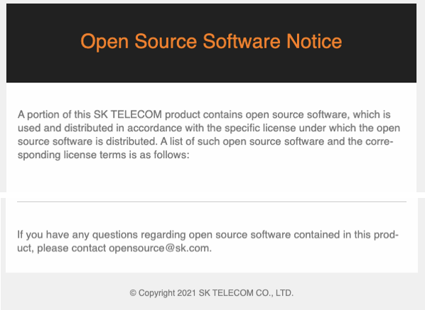
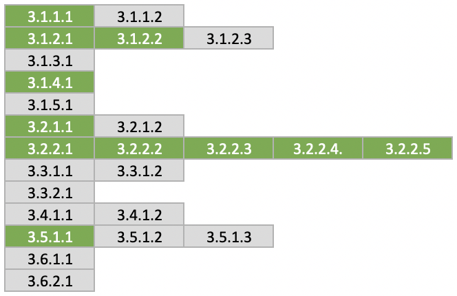

## 오픈소스 정책 문서화

기업은 소프트웨어 개발, 서비스, 배포에 관혀는 조직이 올바르게 오픈소스를 활용하기 위한 원칙으로 구성된 오픈소스 정책을 수립하여 문서화하고 이를 조직 내 전파해야 한다. 

일반적인 오픈소스 정책은 다음을 포함한다.

- 오픈소스를 사용하여 소프트웨어 제품과 서비스를 만들어서 배포하기 위한 원칙
- 외부 오픈소스 커뮤니티에 기여하기 위한 원칙
- 기업의 소프트웨어를 오픈소스로 공개하기 위한 원칙

다음 페이지에서 ISO/IEC 5230의 요구사항을 충족하는 샘플 오픈소스 정책 문서를 제공한다. : “[부록 1. 샘플 오픈소스 정책](https://haksungjang.github.io/docs/openchain/#%EB%B6%80%EB%A1%9D-1-%EC%83%98%ED%94%8C-%EC%98%A4%ED%94%88%EC%86%8C%EC%8A%A4-%EC%A0%95%EC%B1%85)” 


각 기업은 이 샘플 정책을 기반으로 회사의 비즈니스 전략과 환경에 맞게 수정하여 사용할 수 있다.

이와 같이 수행한다면 ISO/IEC 5230에서 요구하는 다음 입증 자료를 준비할 수 있다.

{}

* <b>3.1.1.1 문서화된 오픈소스 정책</b>

{}

| 자체 인증 1.a  | 배포용 소프트웨어의 배포를 위한 오픈소스 라이선스 컴플라이언스를 관리하는 문서화된 정책이 있습니까? |
|---|:---|
|  | Do you have a documented policy that governs open source license compliance of the Supplied Software distribution? |


## 적용 범위 지정

하나의 오픈소스 정책(프로그램)을 반드시 전체 조직에 적용해야 하는 것은 아니다. 기업 내 각 조직과 제품의 특성에 따라 적용 범위를 달리 지정할 수 있다. 조직별로, 제품별로 다른 오픈소스 프로그램을 적용할 수 있다. 마찬가지로, 소프트웨어를 전혀 배포하지 않는 조직이라면 오픈소스 프로그램의 적용 범위에서 제외할 수 있다. 기업은 조직과 제품의 특성을 고려하여 오픈소스 프로그램의 적용 범위와 한계를 명확히 정의하고, 이를 오픈소스 정책에 명시할 수 있다.

기업의 조직과 제품 및 서비스가 비즈니스 환경에 맞추어 변화함에 따라 프로그램의 적용 범위를 결정하거나 수정해야 하는 상황이 발생할 수 있다. 가업은 이에 대응하기 위한 절차를 다음의 예와 같이 준비해야 한다.

1. 오픈소스 프로그램 매니저는 새로운 프로젝트를 시작할 때 해당 프로젝트가 프로그램 적용 범위 내에 포함되는지 여부를 판단한다.
2. 포함된다고 판단되는 경우, 해당 프로젝트를 프로그램 적용 범위에 포함 시키기 위한 제안을 OSRB에 제출한다.
3. OSRB에서 수락할 경우, 이에 맞게 프로그램의 적용 범위를 수정한다.
4. 이외 오픈소스 프로그램 매니저는 프로그램 적용 범위에 대한 검토가 필요하다고 판단되는 경우, 동일한 프로세스에 따라 프로그램 적용 범위에 대한 검토를 시작할 수 있다.

다음의 예와 같은 내용을 오픈소스 정책에 포함할 수 있다.

```
2. 적용 범위
이 정책은 다음 세 부분에 적용한다.

1) 회사가 외부로 제공하거나 배포하는 모든 제품에 적용한다.
   단, 오픈소스를 내부 사용 목적으로만 사용하는 것은 이 정책의 범위에 포함되지 않는다.
2) 구성원이 외부 오픈소스 프로젝트로의 기여 시에 적용한다.
3) 내부 코드를 오픈소스로 공개할 때 적용한다.

적용 범위는 회사의 비즈니스 환경에 맞추어 변경할 수 있으며, 이를 위한 절차는 다음과 같다.

1) 오픈소스 프로그램 매니저는 신규사업, 조직개편 등 회사의 비즈니스 환경이 변화에 따라
   정책의 적용 범위 변경이 필요하다고 판단할 경우, 이를 위한 제안을 OSRB에 제출한다.
2) OSRB에서는 적절한 수준의 적용 범위 변경을 승인한다.
3) OSRB는 오픈소스 정책을 수정하여 정책의 적용 범위를 변경한다.
```

이와 같이 수행한다면 ISO/IEC 5230에서 요구하는 다음 입증 자료를 준비할 수 있다.

{}

* <b>3.1.4.1 프로그램의 적용 범위와 한계를 명확하게 정의한 문서화된 진술</b>

{}

| 자체 인증 1.g  | 프로그램의 적용 범위를 결정하는 프로세스가 있습니까? |
|---|:---|
|  | Do you have a process for determining the scope of your Program? |


| 자체 인증 1.h  | 프로그램의 적용 범위와 한계를 명확하게 정의한 문서화된 진술이 있습니까? |
|---|:---|
|  | Do you have a written statement clearly defining the scope and limits of the Program? |

## 외부 문의 대응 담당자 지정 / 연락처 공개

오픈소스를 사용하여 개발한 제품 혹은 서비스에 대해 고객 및 오픈소스 저작권자가 기업에 오픈소스 관련 문의, 요청 및 클레임을 제기하는 경우가 있다. 외부 문의 및 요청의 주된 내용은 다음과 같다.

- 특정 제품 및 서비스에 오픈소스가 사용되었는지 문의
- 서면 약정(Written Offer)에 언급된 GPL, LGPL 라이선스 하의 소스 코드 제공 요청
- 오픈소스 고지문에 명시되지 않았지만, 제품에서 발견된 오픈소스에 대한 해명 및 소스 코드 공개 요청
- GPL, LGPL 등의 의무로 공개된 소스 코드에 누락된 파일 및 빌드 방법 제공 요청
- 저작권 표시 요청

기업은 이러한 외부 문의를 처리할 담당자를 지정해야 한다. 일반적으로 오픈소스 프로그램 매니저가 담당한다.

그리고, 외부의 오픈소스 개발자가 특정 기업의 오픈소스 컴플라이언스 관련 이슈를 논의하기 위해 기업 담당자에게 연락하고 싶어도 연락 방법을 찾지 못하다가 결국 바로 법적 클레임을 제기하는 경우가 있다. 이를 방지하기 위해 기업은 제 3자가 기업에 오픈소스 관련하여 문의 및 요청을 할 수 있는 연락 방법을 항시 공개적으로 밝혀야 한다.

외부에서 기업에 오픈소스 관련된 문의를 할 수 있는 연락 방법은 (1) 기업 오픈소스 프로그램 매니저의 이메일 주소를 공개하거나, (2) Linux Foundation의 [Open Compliance Directory](https://compliance.linuxfoundation.org/references/open-compliance-directory/)를 이용하는 것이다. 

기업 오픈소스 프로그램 사무소의 대표 이메일 주소는 제품 및 서비스와 동봉하는 오픈소스 고지문에 포함하여 공개하는 것도 좋은 방법이다.




이러한 내용은 아래의 예시와 같이 오픈소스 정책에 반영할 수 있다. 

```
1. 외부 문의 대응
(1) 외부 문의 대응책임
외부로부터 오픈소스 컴플라이언스에 대한 문의 및 요청에 대한 대응은 오픈소스 프로그램
매니저가 담당한다.

오픈소스 프로그램 매니저는 [회사] 내의 적절한 인원에게 문의에 대한 전체 또는 일부의
처리를 할당할 수 있다. 필요할 경우 법률 담당에게 문의하여 처리한다.
외부로부터 오픈소스 컴플라이언스에 대한 문의를 받은 사람은 누구나 이를 오픈소스
프로그램 매니저에게 알려서 신속한 대응이 될 수 있게 한다.

(2) 연락처 공개
오픈소스 프로그램 매니저는 외부에서 오픈소스 관련한 문의 및 요청을 할 수 있도록
담당자의 연락처를 공개적으로 제공한다.

* 오픈소스 고지문에 연락받을 수 있는 이메일 주소 정보를 제공한다.
* Linux Foundation의 Open Compliance Directory에 연락처를 등록한다.

(3) 외부 문의 대응 절차
외부로부터의 오픈소스 컴플라이언스 문의에 신속하고 정확하게 대응한다면 소송까지
진행되는 위험을 크게 줄일 수 있다. 이를 위해 회사는 외부의 오픈소스 컴플라이언스
문의에 대응하기 위해 오픈소스 컴플라이언스 프로세스에서 정의한 외부 문의 대응 절차를
준
```

이와 같이 수행한다면 ISO/IEC 5230에서 요구하는 다음 입증 자료를 준비할 수 있다. 

{}

* <b>3.2.1.1 제 3자가 오픈소스 라이선스 컴플라이언스에 대해 문의 할 수 있는 공개된 방법 (담당자 이메일 주소, 또는 Linux Foundation의 Open Compliance Directory 활용 등)</b>

{}

| 자체 인증 2.a  | 외부 오픈소스 컴플라이언스 문의를 받을 담당자(오픈소스 연락담당자)를 지정했습니까? |
|---|:---|
|  | Have you assigned individual(s) responsible for receiving external open source compliance inquiries (“Open Source Liaison”)? |


| 자체 인증 2.b  | 오픈소스 연락 담당자 정보가 외부에 공개되어 있습니까(예: 이메일 주소 또는 Linux Foundation의 Open Compliance Directory 활용)? |
|---|:---|
|  | Is the Open Source Liaison function publicly identified (e.g. via an email address and/or the Linux Foundation’s Open Compliance Directory)? |

## 인원, 예산 등 지원

기업은 오픈소스 프로그램이 원활하게 기능을 수행할 수 있도록 충분한 리소스를 제공해야 한다. 프로그램 내 각 역할을 담당하는 인원을 적합하게 배치하고, 충분한 예산과 업무 시간을 보장해야 한다. 그렇지 않을 경우, 이를 보완할 수 있는 절차가 마련되어야 한다. 다음의 예시 문장을 오픈소스 정책 문서에 추가할 수 있다.

```
4. 역할, 책임 및 역량

각 역할에 대한 담당 조직의 장은 조직 내 담당자를 지정하고, 담당자가 역할을 충실하게
수행할 수 있는 적절한 사간과 예산을 할당한다. 각 역할의 담당자는 자신이 역할을
수행하면서 적절한 지원이 되지 않는다면 오픈소스 프로그램 매니저에게 문제를 제기해야
한다. 오픈소스 프로그램 매니저는 해당 조직장과 문제 해결을 논의한다. 적절하게
해결되지 않는다면, 오픈소스 프로그램 매니저는 OSRB에 문제 해결을 요청할 수 있다.
OSRB는 상위 조직의 장에게 문제를 공유하고 해결을 요청한다.
```

이와 같이 수행한다면 ISO/IEC 5230에서 요구하는 다음 입증 자료를 준비할 수 있다. 

{}

* <b>3.2.2.2 프로그램 내 각 역할을 담당하는 인원이 적합하게 배치되고, 예산이 적절하게 지원되어야 한다.</b>

{}

| 자체 인증 2.e  | 프로그램 내 각 역할을 담당하는 인원이 적합하게 배치되고, 예산이 적절하게 지원되었습니까? |
|---|:---|
|  | Have the identified Program roles been properly staffed and has adequate funding provided? |

## 법률 자문 제공

기업은 각 역할의 담당자가 오픈소스 컴플라이언스 이슈 해결을 위해 법률적인 검토가 필요할 경우, 이에 대해 법률 자문을 요청할 수 있는 방법을 제공해야 한다. 회사 내의 법무팀을 통해 우선 제공하고, 이슈가 첨예한 경우, 오픈소스 전문 변호사를 보유한 외부 법무 법인을 이용할 수 있다. 이를 위한 오픈소스 정책의 예시는 다음과 같다.

```
4. 역할, 책임 및 역량

(2) 오픈소스 프로그램 매니저
* 오픈소스 프로그램 매니저는 구성원이 오픈소스 관련 법률 자문을 받을 수 있는 방법을
  제공한다.
* 오픈소스 프로그램 매니저는 외부 법무 법인을 참여시켜야 하는지 여부를 결정한다.
  외부 법률 고문의 효과와 적절성은 오픈소스 프로그램 매니저가 매년 평가하고 검토한다.
```

이와 같이 수행한다면 ISO/IEC 5230에서 요구하는 다음 입증 자료를 준비할 수 있다. 

{}

* <b>3.2.2.3 오픈소스 라이선스 컴플라이언스 문제 해결을 위해 내부 또는 외부의 전문 법률 자문을 이용하는 방법</b>

{}

| 자체 인증 2.f  | 오픈소스 컴플라이언스와 관련된 문제 해결을 위해 내부 또는 외부의 법률 전문 자문을 이용하는 방법이 있습니까? |
|---|:---|
|  | Is legal expertise pertaining to internal and external open source compliance identified? |


참고로, OpenChain 프로젝트에서는 파트너 프로그램을 통해 오픈소스 관련 자문을 제공하는 글로벌 법무법인 리스트를 제공한다. : [https://www.openchainproject.org/partners](https://www.openchainproject.org/partners)

OpenChain 파트너로 등록된 법무법인은 OpenChain 프로젝트에서 요구하는 요건을 충족한 곳들이며, 대한민국에서는 유일하게 법무법인 태평양이 등록되어 있다.

## 내부 책임 할당 절차

오픈소스 컴플라이언스를 위한 내부 책임을 할당하는 절차가 있어야 한다. 이는 오픈소스 프로그램 매니저의 역할이다. 오픈소스 프로그램 매니저는 이슈를 파악하고 각 역할의 담당자에게 적절히 이슈를 할당해야 한다. 이를 위해 기업은 오픈소스 정책 문서에 이러한 내용을 아래와 같이 기술할 수 있다.

```
4. 역할, 책임 및 역량

(2) 오픈소스 프로그램 매니저

오픈소스 프로그램 매니저는 회사의 오픈소스 프로그램에 대한 총괄 책임을 담당한다. 
오픈소스를 사용한 제품과 서비스의 오픈소스 컴플라이언스를 보장하기 위해 다음 사항에 
대한 책임이 있다.

* 오픈소스 컴플라이언스를 위해 필요한 역할을 정의하고, 각 역할을 책임질 담당 조직 
및 담당자를 지정한다. 필요 시 OSRB와 협의한다.
```

이와 같이 수행한다면 ISO/IEC 5230에서 요구하는 다음 입증 자료를 준비할 수 있다. 

{}

* <b>3.2.2.4 오픈소스 컴플라이언스에 대한 내부 책임을 할당하는 문서화된 절차</b>

{}

| 자체 인증 2.g  | 오픈소스 컴플라이언스에 대한 내부 책임을 할당하는 문서화된 절차가 있습니까? |
|---|:---|
|  | Do you have a documented procedure assigning internal responsibilities for Open Source compliance? |


## 미준수 사례 대응

컴플라이언스 미준수 문제가 제기된 경우, 기업은 이를 신속히 검토하고 대응하기 위한 절차를 문서화해야 한다. 다음의 예시를 참고하여 오픈소스 정책에 포함할 수 있다.

```
1. 오픈소스 사용

(5) 컴플라이언스 이슈 수정 절차
컴플라이언스 이슈가 제기될 경우, 오픈소스 프로그램 매니저는 다음의 절차를 수행하여
신속히 대응한다.

1. 문의 접수를 확인하고 적절한 해결 시간을 명시한다.
2. 이슈 내용이 실제 문제를 지적하고 있는지를 확인한다. (아닐 경우, 이슈 제기자에게
   문제가 아님을 알린다.)
3. 실제 문제인 경우, 우선순위를 정하고 적절한 대응 방안을 결정한다.
4. 대응을 수행하고, 필요할 경우, 오픈소스 컴플라이언스 프로세스를 적절하게 보완한다.
5. 위의 내용은 Jira Tracker를 이용하여 보존한다.
```

이와 같이 수행한다면 ISO/IEC 5230에서 요구하는 다음 입증 자료를 준비할 수 있다. 

{}

* <b>3.2.2.5 미준수 사례를 검토하고 이를 수정하기 위한 문서화된 절차</b>

{}

| 자체 인증 2.h  | 미준수 사례를 검토하고 이를 수정하기 위한 문서화된 절차가 있습니까? |
|---|:---|
|  | Do you have a documented procedure for handling review and remediation of non-compliant cases? |

## 오픈소스 기여 정책

글로벌 소프트웨어 기업들은 제품을 만들고 서비스를 하는 데 오픈소스를 사용하는 것뿐만 아니라 오픈소스 프로젝트에 기여하며 창출할 수 있는 전략적 가치도 중요하게 여긴다. 그러나 오픈소스 프로젝트 생태계와 커뮤니티 운영방식에 대한 충분한 이해와 전략 없이 접근한다면 예기치 않게 회사의 명성이 손상되고 법적 위험이 발생할 수 있다. 따라서 기업은 오픈소스 프로젝트로의 참여 및 기여를 위한 전략과 정책을 만드는 것이 중요하다.

이러한 오픈소스 기여에 대한 정책은 NIPA OpenChain 해설서 [부록 1. 샘플 오픈소스 정책](https://haksungjang.github.io/docs/openchain/#%EB%B6%80%EB%A1%9D-1-%EC%83%98%ED%94%8C-%EC%98%A4%ED%94%88%EC%86%8C%EC%8A%A4-%EC%A0%95%EC%B1%85)의 [7. 오픈소스 기여](https://haksungjang.github.io/docs/openchain/#7-%EC%98%A4%ED%94%88%EC%86%8C%EC%8A%A4-%EA%B8%B0%EC%97%AC)를 참고할 수 있다.


이와 같이 수행한다면 ISO/IEC 5230에서 요구하는 다음 입증 자료를 준비할 수 있다. 

{}

* <b>3.5.1.1 문서화된 오픈소스 기여 정책</b>

{}

| 자체 인증 5.a  | 조직을 대신하여 오픈소스 프로젝트에 기여하는 것을 관리하는 정책이 있습니까? |
|---|:---|
|  | Do you have a policy that governs contributions to open source projects on behalf of the organization? |

위와 같은 내용을 포함하는 오픈소스 정책까지 수립하게 되면 ISO/IEC 5230 요구사항 중 다음의 사항을 만족하게 된다. 

